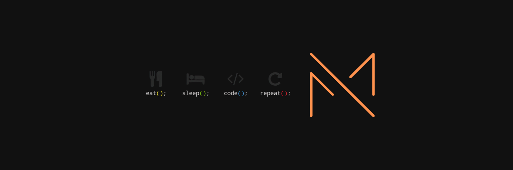

# Hi, I'm Mehedi Imun! 

I'm a web developer and web instructor at Programming Hero.

I am a passionate web instructor at Programming Hero, specializing in web development technologies such as Typescript, Express, Mongoose, Rest API, Redux, React, RTK Query, Testing, GraphQL, Deployment, PostgreSQL, Next.js, and Docker. With a commitment to providing exceptional education and support to students, I play a vital role in their journey to becoming skilled web developers.
As a web instructor at Programming Hero, I deliver engaging and informative lessons while providing personalized feedback and support to students. Collaborating with colleagues, I continuously enhance our curriculum and teaching methodologies to ensure students are prepared for the dynamic field of web development.

<h2 align="center">My Online Presence</h2>

<h2 align="center">My Techs & Tools</h2>

<h2 align="center">My GitHub Stats</h2>

    
    

<h2 align="center">My Projects</h2>

<h2 align="center">My Contributions</h2>

